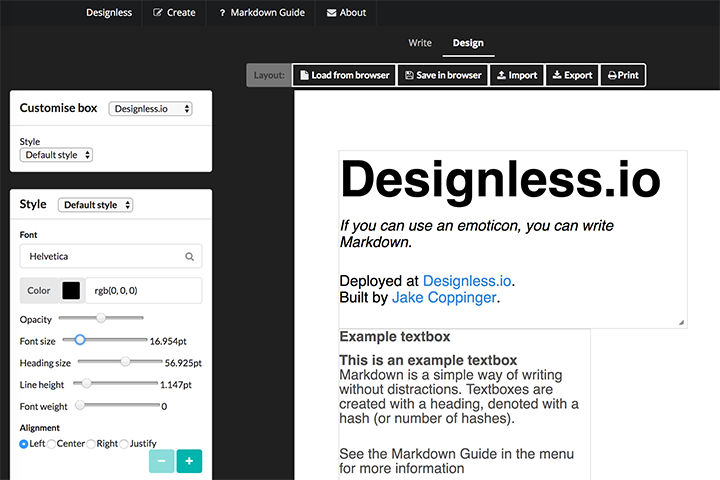

# Designless

Designless is a web app for writing documents in Markdown and designing them into a beautiful page layout. Try it out at [designless.io](http://www.designless.io)

Built in late 2015.




## Getting started

Clone repo

```
git clone git@github.com:jakecoppinger/designless.git
cd designless
```

## Installing dependencies

### Install Node and npm package manager

#### Debian / Ubuntu

```
sudo apt-get update
sudo apt-get -y install nodejs
sudo apt-get -y install npm
sudo apt-get -y install nodejs-legacy
```

Bower will need nodejs-legacy to work

#### mac OS (with [Homebrew](http://brew.sh/))

```
brew update
brew install node
```

### Install npm & Bower packages
This will take a while.

```
npm install
bower install
```

During `npm install`, accept the defaults for the SemanticUI installation.


## Building from source


Build SemanticUI (the front end framework)

```
cd semantic
gulp build
cd ..
```

Build with Gulp (while in project root directory)

```
gulp build
```

This will output a build to `dist/`

To spin up live reloading server (from project root):

```
gulp serve
```

You will then be able to try the app at `http://localhost:3000`

## Deployment

Front end URL routing doesn't work with a standard Python or Apache server. You will be able to navigate to the `/create` page but with a reload you will get a 404. The server needs to be specially configured to send all requests to the index.html page, where the JavaScript will route it.

To see a demo of the app in action, see [designless.io](http://www.designless.io)

## Built With

* [AngularJS](https://angularjs.org/) - Front end framework
* [SemanticUI](http://semantic-ui.com/) - Front end UI
* [npm](https://www.npmjs.com/) - Used for build tool dependencies
* [gulp](http://gulpjs.com/) - Builds the project
* [BrowserSync](https://browsersync.io/) - For live-reload browser testing

## Authors

- [Jake Coppinger](http://www.jakecoppinger.com)


## License

This project is licensed under the GNU GPLv3 License - see the [LICENSE.md](LICENSE.md) file for details.